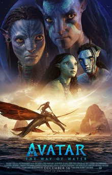

Haipeng Ren  
5 - Introduction to Markdown  
09/28/2023

# Basic HTML Elements in Markdown

## Avatar: *The Way of Water*



[The Way of Water](https://www.imdb.com/title/tt1630029/) is a 2022 `American epic science fiction film` co-produced and directed by **James Cameron**, who co-wrote the screenplay with Rick Jaffa and Amanda Silver from a story the trio wrote with Josh Friedman and Shane Salerno. *Jake Sully* lives with his newfound family formed on the extrasolar moon Pandora. Once a familiar threat returns to finish what was previously started, 
`<p>Jake must work with Neytiri and the army of the Na'vi race to protect their home</p>`.

```
This is a wonderful and beautiful movie. 
```
* * *
### *The information of Director, Wirters and Stars*

* **Director:** James Cameron
* **Writers:** James Camron, `Rick Jaffa`, Amanda Silver
* **Stars:** Sam Worthington, Zoe Saldana, Sigourney Weaver